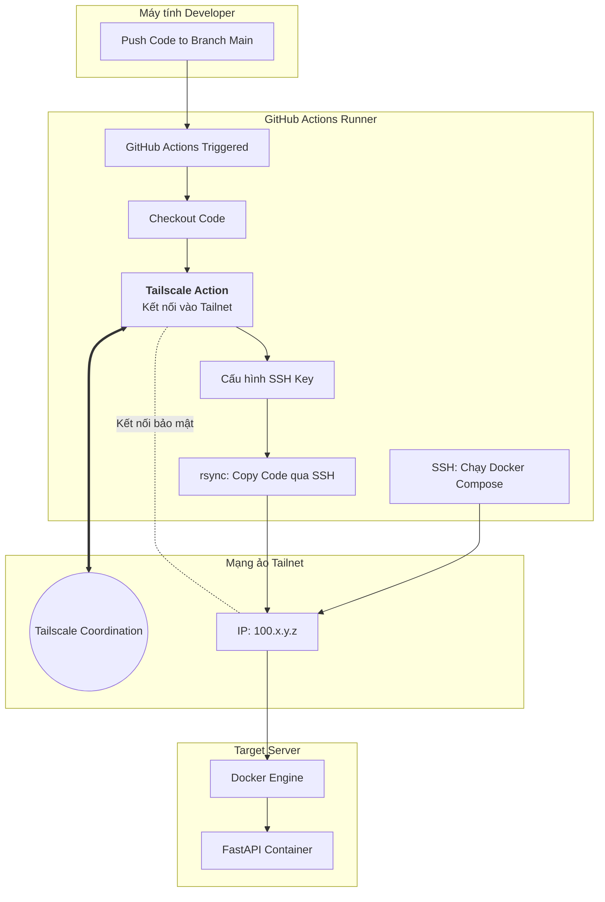

# Github-Deployment-Test

```mermaid
graph TD
    subgraph Local_Machine [Máy tính Developer]
        A[Push Code to Branch Main]
    end

    subgraph GitHub_Cloud [GitHub Actions Runner]
        B[GitHub Actions Triggered]
        C[Checkout Code]
        D[<b>Tailscale Action</b><br/>Kết nối vào Tailnet]
        E[Cấu hình SSH Key]
        F[rsync: Copy Code qua SSH]
        G[SSH: Chạy Docker Compose]
    end

    subgraph Tailscale_Network [Mạng ảo Tailnet]
        D <==> H((Tailscale Coordination))
        D -. Kết nối bảo mật .- I[Target Server]
    end

    subgraph Private_Server [Target Server]
        I[IP: 100.x.y.z]
        J[Docker Engine]
        K[FastAPI Container]
    end

    A --> B
    B --> C
    C --> D
    D --> E
    E --> F
    F --> I
    G --> I
    I --> J
    J --> K
```